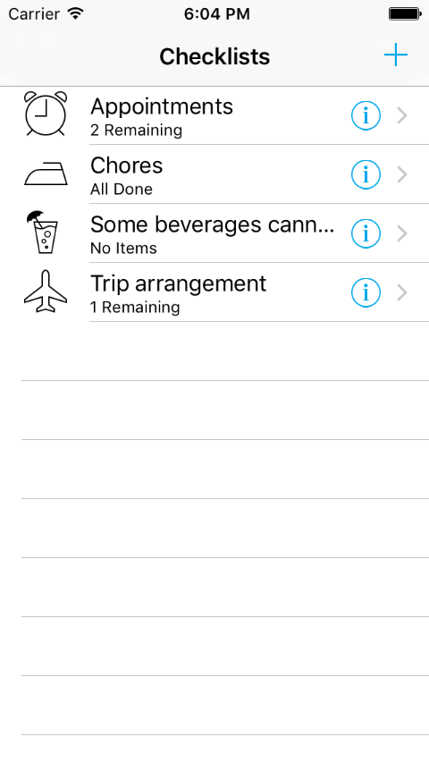
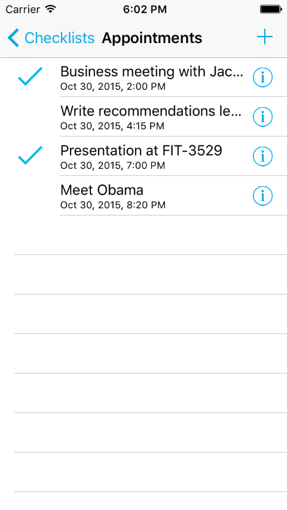
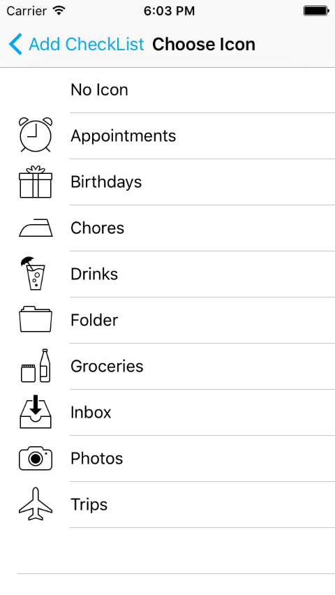
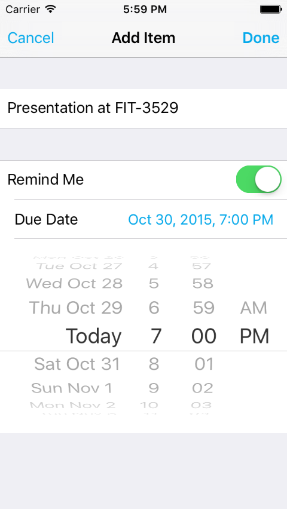
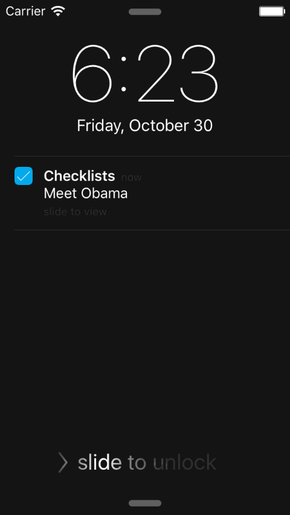

#Checklists
This is a time arrangement app capable of grouping things in different lists and seting the reminder time of each item. 

----------------------
## Screenshots
* Home page:  
  
* Tab any list you will enter list page:  

* You can choose a list icon for your list:   

* You can add an arrangement to a list:  

* And at the right time, you will receive a notification:    
  

-----------------------
## Issues
Only test on iPhone 5s, and some images lack for 6 and 6 plus.

-----------------------
Reference from the tutorial [*The iOS Apprentice*](http://www.raywenderlich.com/store/ios-apprentice), and the [Chinese version](https://github.com/eseedo/kidscoding).
